# 基于可观测掩码与扰动归因的多模态情感预测

## 摘要

同一段表达中的文字、声音与画面具有不同的时间尺度，局部信息缺失又会改变模型能够利用的证据。针对这些问题，本文分别研究原始视频的特征构建、局部缺失下的情感预测以及预测依据的量化解释。

首先，以转写词的起止时间为联系三种模态的共同坐标，建立基于CTC强制对齐与区间交集加权的特征聚合方法。文本、音频和视觉分别表示为768、70和61维向量，并用独立掩码记录无有效观测的位置。在100段原始视频中，1764个词通过对齐规则，占1932个词的91.3%；有效人脸抽样帧占71.61%。中心裁剪候选将零人脸片段由24段降至5段，但检出人物与说话人的一致性仍需人工核验。

其次，利用官方对齐特征构建三分支时序Transformer，各分支仅汇聚可观测位置，通过表示拼接与覆盖率信息完成融合，同时预测三类情感极性和连续情感强度。训练采用局部连续遮蔽，并设置单模态辅助监督。在54种模拟缺失条件下进行同种子比较：降低学习率带来一致改善，门控及辅助监督未显示稳定增益。最终三种子集成在728条验证样本上的准确率为0.6374、宏F1为0.6173、MAE为0.5984、Pearson相关系数为0.6469。文本参与遮蔽时，平均宏F1由文本可用组的0.6154降至0.5614，表明模型对文本缺失最为敏感。

最后，固定预测器，通过三模态Shapley分解与局部窗口扰动定位模型依据，再以原词遮蔽和BERT重编码核验文本候选。123条验证样本中，首选窗口使原类别概率平均下降0.1432，随机窗口为0.0518；73.17%的样本中首选窗口的影响更大。附件4共得到75条局部候选，其中39条文本候选有34条通过重编码方向检验。本文完成附件3、4的全量预测与解释汇总，并保留时间重建、参考输入和人工审查尚未完成等限制。

关键词：多模态情感预测；时间对齐；局部缺失；可观测掩码；辅助监督；Shapley归因

# 1 问题理解与研究路线

## 1.1 三个问题及其联系

多模态情感分析试图结合语言内容与非语言信号，判断表达的极性和程度。CMU-MOSEI将这些信息组织为具有时序关系的多模态样本[1]。在本题中，极性为负面、中性、正面三类，强度取值为−3至3；强度为0的标签仅归入中性。强度的符号表示方向，绝对值表示程度，不能将负面类别理解为一个强度数值。

问题一关注表示是否建立得合理：从附件1的视频和转写出发，定义可追溯的文本、声音与视觉特征，并说明其时间对应关系。问题二关注信息不完整时如何预测：某个模态的部分连续位置不可用，其余位置仍应被利用。问题三关注预测依据：模型应指出主要参考模态，并把局部证据对应到原文和原始素材。

三问在研究主题上相互联系，但输入路径并不相同。第一问自主提取的特征用于对齐展示与质量检查，不进入后两问训练。第二、三问使用附件2的官方特征，分别对附件3、4推理。第三问复用第二问最终模型参数，在其外部增加解释计算。图1给出数据与方法之间的实际关系。

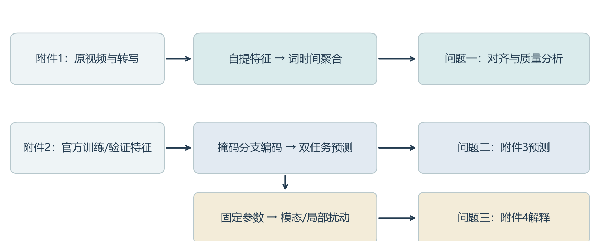

## 1.2 需要解决的关键困难

第一个困难是时间粒度不同。文字按词或子词排列，声音按短时窗口分析，画面由离散帧组成。直接按照数组下标拼接不能保证来自同一段表达。本文采用词区间作为时间参考，并按帧与区间的交集聚合，使每个输出向量都能回到一个明确的词及其估计时间。

第二个困难是零值的含义不唯一。序列补齐、特殊符号、真实的局部缺失都可能表现为无信息位置；部分文本补齐向量又不为零。因而先确定内容位置，再判断各模态是否可观测。缺失位置虽以零值保存，但不参与注意力的键值聚合和有效位置池化。

第三个困难是解释的检验。较大的注意力或融合系数不必然说明某条输入决定了预测。本文直接比较固定模型在保留和替换输入时的输出差异，用模态分解回答“哪一路信息影响较大”，用局部扰动回答“哪段信息影响较大”，再检查文本候选对原词级干预是否敏感。

## 1.3 数据范围与研究边界

表1列出本文使用的数据。附件2保持题给划分，不将附件1标签补入训练。附件3、4不提供情感真值，因此本文只报告其预测与解释，不能计算专项集准确率。本文的定量模型评价采用附件2验证集，未提供独立盲测泛化结论。

表1 数据来源、规模与用途

| 数据 | 样本数 | 输入 | 用途 |
|---|---:|---|---|
| 附件1 | 100 | 原视频、转写和标签对应表 | 自提特征、对齐展示 |
| 附件2训练集 | 3395 | 官方三模态对齐特征 | 学习参数与标准化统计 |
| 附件2验证集 | 728 | 官方特征与标签 | 比较方案、保存权重、分析错误 |
| 附件2测试集 | 727 | 官方特征与标签 | 本文不报告其模型成绩 |
| 附件3 | 30 | 不完整模态专项特征 | 最终预测 |
| 附件4 | 20 | 专项特征与配套素材 | 最终预测及解释 |

# 2 模型假设与符号

## 2.1 基本假设

（1）给定转写是强制对齐的目标词序列。对齐过程估计词出现的时间，不独立证明转写与真实发音完全一致。

（2）解码时间戳可作为原视频内部的时间坐标。CTC输出的词边界是估计值，其置信度用于筛查低可靠位置，不视为人工边界误差的替代指标。

（3）官方音视频特征在有效内容位置上的全零行被操作性地视为不可观测。该规则不推断零值的形成原因；自然缺失与人为遮蔽分别记录。

（4）连续区间遮蔽能够用于检验局部缺失敏感性，但模拟分布不完全代表专项集或真实采集中的缺失分布。

（5）参考输入替换后的预测变化反映固定模型对输入的依赖。它不构成人物情绪的因果解释，也不意味着被遮蔽后的输入仍符合自然数据分布。

## 2.2 主要符号

表2 主要符号及其含义

| 符号 | 含义 | 取值或维度 |
|---|---|---|
| I_j=[s_j,e_j] | 第j个词的估计时间区间 | 秒 |
| A_k，V_l | 音频帧、视频帧支撑区间 | 秒 |
| c_it | 样本i的内容位置标志 | 0或1 |
| o_it^m | 模态m在位置t的可观测标志 | 0或1 |
| h_i^m，ρ_i^m | 模态池化表示及覆盖率 | 96维；[0,1] |
| p_i，ŷ_i | 三类概率及强度预测 | 3维；[−3,3] |
| J | 本地综合验证分 | 越小越好 |
| φ_m^c，φ_m^r | 类别概率、强度的模态贡献 | 带符号数值 |
| d_m,I | 局部窗口的类别支持度 | 概率差 |

# 3 问题一：三模态特征与时间对应模型

## 3.1 特征选择与表示

文本用于表达语义内容，声音用于描述短时声学变化，视觉用于描述面部活动。三种表示不需要具有相同维度；对齐要求它们对应同一段表达，而非逐维语义一致。表3给出自提特征与官方特征的区别。

表3 第一问特征定义与后两问输入维度

| 模态 | 第一问维度 | 第一问组成 | 官方维度 |
|---|---:|---|---:|
| 文本 | 768 | 冻结BERT的逐子词隐藏状态 | 768 |
| 音频 | 70 | 25维LLD＋20维MFCC＋20维差分＋5维统计量 | 74 |
| 视觉 | 61 | 52维blendshape＋3维姿态角＋6维几何比值 | 35 |

文本采用bert-base-uncased[2]。分词器输出子词及其原文字符范围，BERT为每个子词生成上下文表示。模型在特征提取中保持冻结。由于一个词可能被拆成多个子词，本文保留词—子词映射，不将二者混为同一粒度。

音频统一为16 kHz。短时分析窗口为400个采样点，步长160个采样点，分别对应25 ms与10 ms。openSMILE提取eGeMAPSv02的25维低层描述量[3]；librosa提取20维MFCC、其一阶差分，以及RMS、过零率、谱质心、谱带宽、谱滚降点[4]。例如窗口内RMS可写为式（1），它反映短时幅度大小，但不能单独确定情感极性。

$$ R_k=\sqrt{\frac{1}{N}\sum_{n=1}^{N}u_k(n)^2} $$

两套工具的帧中心网格不同，先把openSMILE输出按时间线性插值到librosa网格，再拼接成70维向量。设t处于相邻帧中心τ_a与τ_b之间，单维插值为式（2）；边界外采用端点值。这一步统一音频内部时间网格，不用于补齐视觉缺脸。

$$ f(t)=\frac{\tau_b-t}{\tau_b-\tau_a}f(\tau_a)+\frac{t-\tau_a}{\tau_b-\tau_a}f(\tau_b) $$

视觉按约10帧/秒抽样，保存解码时间戳。MediaPipe Face Landmarker输出的面部混合形状分数、姿态矩阵及关键点用于构成61维表示[5]。其中几何比值对距离进行归一化，以减小画面尺度变化的直接影响。未检出人脸的帧以零值存储，同时令有效标志为0；不能把该帧解释成“没有表情”。

## 3.2 基于词区间的跨模态聚合

采用wav2vec2-base-960h生成CTC帧级概率，并在给定目标文本约束下寻找最佳路径[6]。设目标字符序列为a，允许路径集合为Π(a)，则最大概率路径满足式（3）。本过程属于强制对齐，不是自由语音识别。

$$ \pi^*=\arg\max_{\pi\in\Pi(a)}\sum_{t=1}^{T}\log P(\pi_t\mid u) $$

根据路径中属于同一词的帧得到起止时间I_j。词置信度为被分配字符帧的目标概率均值；低于0.1或目标文本不受支持时，该词不能为音视频聚合提供有效时间。分词器字符范围将子词映射到与其重叠最多的原词。

对于词区间I_j与音频帧支撑区间A_k，令q_k表示帧有效性，交集时长及权重和定义为式（4）。

$$ w_{jk}=q_k\max(0,\min(e_j,b_k)-\max(s_j,a_k)),\qquad W_j=\sum_k w_{jk} $$

当W_j大于0时，词级音频表示为式（5）；否则存储零向量并将掩码置0。视觉采用同样的聚合形式，将音频帧替换为有效人脸帧。

$$ g_j=\frac{\sum_k w_{jk}a_k}{W_j},\qquad W_j>0 $$

视频帧支撑边界取相邻抽样时间戳的中点，首尾受视频时长约束，避免用标称帧率反推时间。属于同一词的子词共享其音视频聚合向量；文本侧仍保留各自的BERT向量。[CLS]、[SEP]及补齐位置不对应实际词时间，其音视频掩码为0。图2展示从不同帧率到词区间的聚合关系。

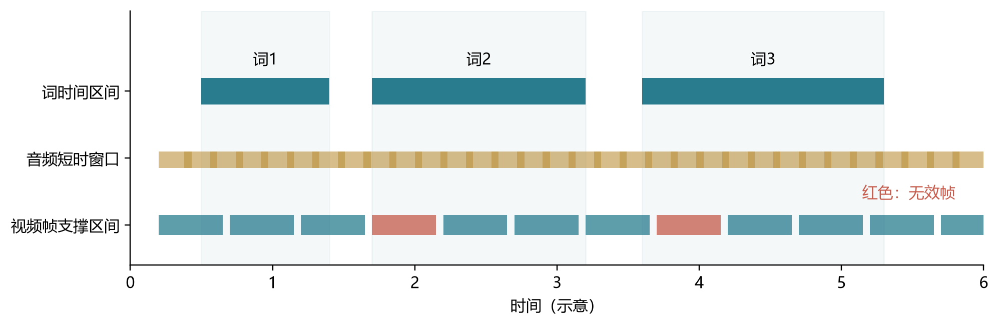

长度不足50不意味着缺少50等份时间。完整表示按真实子词数保存；另提供定长切窗，每窗最多48个内容子词，加首尾特殊符号后补至50，相邻窗口起点间隔38个内容子词。本批样本有94条仅需一窗、6条需两窗，完整token数为7—84。切窗不会将整段视频均分为50段。

## 3.3 质量评价与全量结果

没有人工词边界和目标人物真值时，不能直接计算对齐准确率。本文分别统计词覆盖率与人脸帧检出率，定义为式（6）。样本均值与总体微平均的权重不同，不能混用。

$$ C_i^w=\frac{N_i^{validword}}{N_i^{word}},\qquad C_i^v=\frac{N_i^{validface}}{N_i^{sampledframe}} $$

样本出现未解决词、疑似人脸切换，或有效人脸帧低于抽样帧的一半时，自动标记为REVIEW；其余为PASS。PASS只表示未触发这些规则。图3以每条视频为单位展示两项指标，表4给出总体数量。

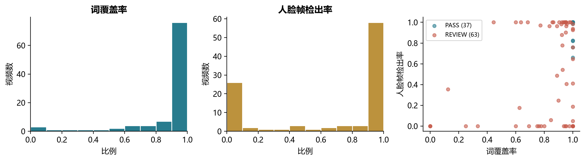

表4 第一问基础版本自动核验结果

| 项目 | 数值 | 解释 |
|---|---:|---|
| 样本数 | 100 | 全量处理 |
| PASS / REVIEW | 37 / 63 | 自动规则状态 |
| 有效词 / 总词 | 1764 / 1932 | 微平均91.3% |
| 未解决词 | 168 | 156低CTC分数，12目标文本不受支持 |
| 有效人脸帧 / 抽样帧 | 5595 / 7813 | 微平均71.61% |
| 零人脸片段 | 24 | 原始未裁剪画面 |
| 有效音频 / 视觉token | 2111 / 1562 | 由词时间聚合后有效的位置 |

词覆盖率较高并不保证视觉可用。图4所示样本的词时间和人脸观测均可形成对应关系；与之对照，样本-571d8cVauQ$_$0的词对齐未出现未解决词，但原画面的52个抽样帧均未检出人脸。二者的视觉可用性不同，因此质量分析需要按模态分别进行。

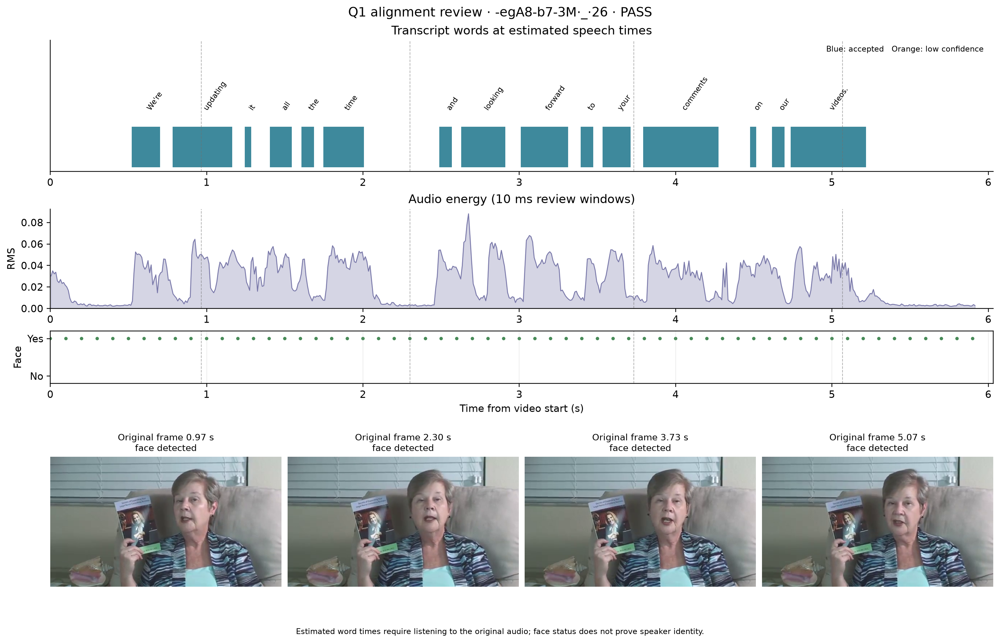

## 3.4 裁剪修正的收益与风险

对零人脸片段尝试中心裁剪后，多数片段恢复了检出。进一步形成的候选版本在27条视频中采用裁剪，有效人脸帧增至7110，零人脸片段降至5，有效视觉token增至2008；词对齐保持不变。图5比较两版的覆盖情况。

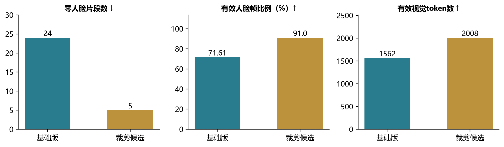

裁剪改变人脸相对尺度及画面内容，因而可能帮助检测，也可能将电视中的人物、听众或其他人纳入特征。检出增加不能等价为正确说话人增加。本文以基础版本作为第一问的完整结果口径，将裁剪版本作为改进实验；两版均保留，待人工核验后再决定最终采用版本。附录A汇总基础版100条样本，逐样本向量与掩码另存于特征文件。

# 4 问题二：局部缺失下的联合情感预测

## 4.1 内容掩码与可观测掩码

官方对齐输入的文本、音频、视觉维度分别为768、74和35，序列槽位数为50。文本内容位置由text_bert的注意力掩码和特殊符号界定，记为c_it。文本可观测掩码初始取内容掩码；音视频在内容位置上满足至少一维绝对值大于10^−6时记为可观测。

$$ o_{it}^{m}=c_{it}\,\mathbf{1}\{\max_d|x_{itd}^{m}|>10^{-6}\},\quad m\in\{A,V\} $$

这一区分十分必要：验证集728条中，85条至少存在一个音视频内容位置的全零行，其中视觉85条、音频1条。原样验证条件表示“不追加人为遮蔽”，不代表输入天然完整。文本补齐位置则不能单靠是否全零判断。

音视频每维的均值μ和标准差σ仅用训练集可观测行估计。验证与专项推理使用同一统计量；不可观测行在标准化后再次置零，如式（8）。

$$ \widetilde{x}_{itd}^{m}=o_{it}^{m}\frac{x_{itd}^{m}-\mu_d^m}{\max(\sigma_d^m,10^{-6})} $$

附件3没有直接提供768维文本向量，因此由其text_bert输入调用固定版本BERT重建。训练中的文本遮蔽也采用重编码：若仅把被遮位置的缓存向量置零，其余BERT位置仍可能携带被遮词的上下文信息。将目标token替换成[MASK]后重新编码，可以更直接地改变原词输入。

## 4.2 分支时序编码与覆盖率融合

为使各路缺失分别处理，文本、音频和视觉先独立编码。各分支将输入线性投影至96维，经LayerNorm后加入位置嵌入，如式（9）。位置向量用于区分同一模态中的序列位置。

$$ u_{it}^{m}=\mathrm{LN}(W_m\widetilde{x}_{it}^{m}+b_m)+e_t^m $$

每个分支采用一层、四头Transformer，前馈隐藏维度192，dropout为0.1。单个注意力头的计算形式为式（10），其中B的不可观测键位置取负无穷，其他位置取0[7]。

$$ Z=\mathrm{softmax}\left(\frac{QK^{\top}}{\sqrt{d_k}}+B\right)V $$

对无可观测位置的分支，计算中临时保留安全位置以避免全屏蔽造成数值异常，最终输出仍归零。时序输出z经掩码均值池化，覆盖率同时保留，如式（11）。分母以内容长度为基准，因此ρ能够反映当前样本的信息完整度。

$$ h_i^m=\frac{\sum_t o_{it}^m z_{it}^m}{\max(1,\sum_t o_{it}^m)},\qquad \rho_i^m=\frac{\sum_t o_{it}^m}{\max(1,\sum_t c_{it})} $$

三路96维表示与三个覆盖率拼成291维输入，经128维共享层生成融合表示。最终模型使用直接拼接，没有学习式模态门控。覆盖率作为输入供网络利用，不强制规定缺失越多权重一定越低。图6给出模型结构。

$$ h_i=\mathrm{Dropout}(\mathrm{ReLU}(W_f[h_i^T;h_i^A;h_i^V;\rho_i^T;\rho_i^A;\rho_i^V]+b_f)) $$

分类和回归共享h_i，但使用不同输出头。分类概率取softmax，强度采用3tanh限幅，如式（13）。这能保证强度范围，却不能保证两个头的符号始终一致。

$$ p_i=\mathrm{softmax}(W_ch_i+b_c),\qquad \widehat{y}_i=3\tanh(w_r^{\top}h_i+b_r) $$

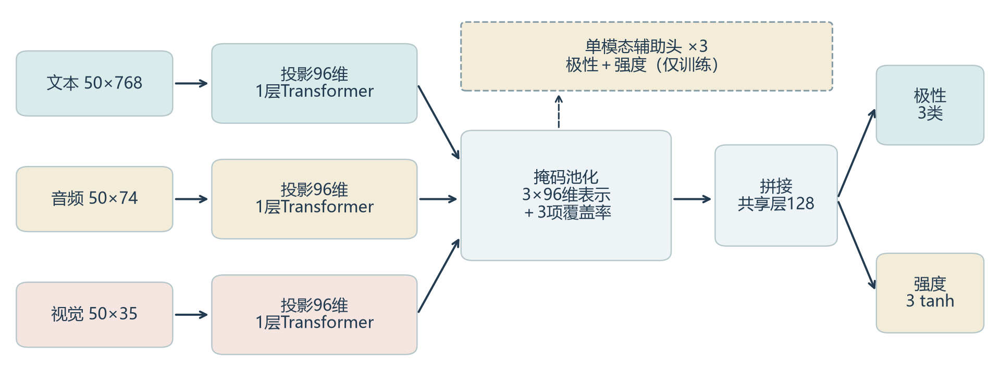

在各单模态池化表示上设置三分类与强度辅助头，目的是对分支施加直接的任务约束。该设计参考了EMOE关注单模态预测能力的思路[8]，但本文没有实现其专家混合与单模态蒸馏机制。最终网络共有353264个可训练参数，冻结BERT不计入这一数量。

## 4.3 连续缺失增强与训练目标

随机逐点删除与连续时间段缺失不同。本文在每轮训练中，为每条样本生成一个连续区间遮蔽视图。以0.75概率选择单模态，以0.25概率选择双模态；单模态T/A/V或双模态TA/TV/AV各自在组内等概率抽取。名义长度比例r从0.1、0.3、0.5中等概率选择，内容长度为L时，遮蔽长度为式（14）。

$$ \ell=\min(L,\max(1,\lceil rL\rceil)) $$

起点从合法内容位置中随机抽取；双模态使用同一所选区间。若没有实际删除有效信息或导致三模态全部不可用，则重新抽样。整数取整会使短文本的实际比例高于名义比例，且自然零段会影响实际新增缺失量。因此10%、30%、50%是抽样规则，不是每条样本最终损失的信息比例。

融合头采用类别加权交叉熵与Huber回归损失。类别权重取训练样本数平方根的倒数并归一化，如式（15）。类别权重降低多数类对目标的直接支配，但不能消除类别边界重叠。

$$ \alpha_c=\frac{n_c^{-1/2}}{\frac{1}{3}\sum_{k=1}^{3}n_k^{-1/2}} $$

对一个批次，交叉熵按照目标类别权重归一化；Huber损失在残差绝对值不超过1时为平方项，否则为线性项，可用式（16）统一表达。

$$ H(e)=\frac{1}{2}\min(|e|,1)^2+\max(|e|-1,0) $$

$$ L_{main}=\frac{-\sum_i\alpha_{y_i^c}\log p_{i,y_i^c}}{\sum_i\alpha_{y_i^c}}+\frac{1}{n}\sum_i H(\widehat{y}_i-y_i^r) $$

辅助损失在每个模态内对有观测的样本取加权交叉熵项与Huber项的平均，再对当前有观测样本的模态取平均。融合头与辅助头均监督极性和强度。原样视图x和遮蔽视图x′共享网络参数，完整目标为式（18）。

$$ L=L_{main}(x)+L_{main}(x')+\frac{0.1}{2}\left[L_{aux}(x)+L_{aux}(x')\right] $$

最终模型未加入Pearson损失、预测一致性损失、表示一致性或门控稳定正则。三个种子均训练30轮，按验证准则分别保存第5、7、4轮。推理对三个模型的分类概率和强度分别取算术平均，辅助头不参与预测投票。

表5 最终模型训练设置

| 参数 | 设置 |
|---|---|
| 随机种子 | 20260923、20260924、20260925 |
| 优化器 | AdamW |
| 学习率 / 权重衰减 | 0.0003 / 0.01 |
| 批量大小 / 训练轮数 | 64 / 每种子30轮 |
| 分支维度 / 层数 / 注意力头 | 96 / 1 / 4 |
| FFN维度 / dropout | 192 / 0.1 |
| 辅助损失系数 | 0.1 |
| 缺失区间 | 单个连续区间，单或双模态 |

## 4.4 评价指标与对照设计

极性任务报告Accuracy与宏平均F1，强度任务报告MAE与Pearson相关系数。宏F1对三类等权，能够揭示中性类较弱而总体准确率掩盖的问题。式（19）—（21）给出定义，P_c和R_c分别为类别精确率与召回率。

$$ \mathrm{Acc}=\frac{1}{n}\sum_i\mathbf{1}(\widehat{c}_i=c_i),\qquad F_{macro}=\frac{1}{3}\sum_{c=1}^{3}\frac{2P_cR_c}{P_c+R_c} $$

$$ \mathrm{MAE}=\frac{1}{n}\sum_i|\widehat{y}_i-y_i| $$

$$ r_P=\frac{\sum_i(y_i-\overline{y})(\widehat{y}_i-\overline{\widehat{y}})}{\sqrt{\sum_i(y_i-\overline{y})^2\sum_i(\widehat{y}_i-\overline{\widehat{y}})^2}} $$

在原样验证集之外，构造6种模态组合×3个位置×3个名义长度比例，共54种缺失场景。前、中、后按内容token顺序定义，不是将视频物理时长分段。各场景都在同一728条验证样本上计算，因此并非54个独立数据集。

用于模型比较的本地综合分J见式（22），上横线表示54种场景平均，F表示宏F1。该准则给缺失场景较高权重，反映本问对鲁棒性的关注；它不是主办方评分公式，也不能代替单项指标。

$$ J=0.25\left(\frac{MAE_0}{3}+1-F_0\right)+0.75\left(\frac{\overline{MAE}_{54}}{3}+1-\overline{F}_{54}\right) $$

## 4.5 表示结构与训练策略的比较

首先用掩码均值池化与MLP形成轻量基线，随后比较时序模型。基线追加连续缺失增强后，平均J由0.6226降至0.6200，但三个种子的方向不完全一致。早融合两层Transformer的J为0.6269，没有超过同预算池化基线。这说明“引入时序结构”本身不足以保证收益，仍需考虑结构和优化设置。

转为独立分支后，学习率10^−3的直接拼接模型J为0.6286；仅将学习率降至3×10^−4，J降为0.6141，三个种子方向一致。与此相比，输出一致性系数0.5的对照仅使J从0.61408降为0.61389，且种子方向不一致，因此未纳入最终目标。

在固定较低学习率后，进一步比较门控、辅助监督、二者组合以及多段遮蔽。表6和图7给出同批集中实验。门控＋辅助头的缺失MAE较低，但宏F1也下降，呈现分类与回归之间的取舍。

@TABLE_CANDIDATES

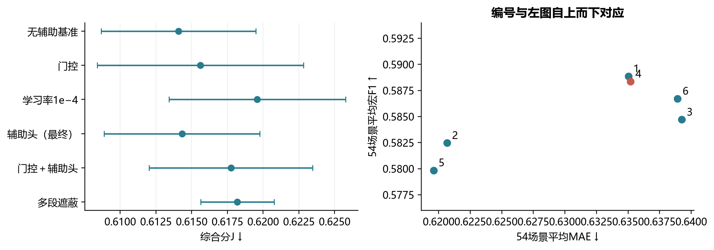

本轮替换门槛要求J均值至少下降0.005、至少两个同种子改善、缺失MAE恶化不超过0.01。五种修改均未通过。最终配置C_uni为比较后确认的方案，其平均J为0.61432，比无辅助基准高0.00024。这里保留辅助监督作为模型组成，但不将其描述为验证规则自动选出的最优结构，也不声称它带来稳定提升。

## 4.6 基础性能及错误分布

最终三种子集成在原样验证集上取得Accuracy 0.63736、宏F1 0.61726、MAE 0.59843、Pearson 0.64691。单模型三种子指标均值与集成后重新计算的指标不同，表7分别列出，避免用一个口径的分类指标搭配另一个口径的回归指标。

表7 最终模型的验证性能

| 评价口径 | Accuracy | 宏F1 | MAE | Pearson |
|---|---:|---:|---:|---:|
| 三种子指标均值，原样 | 0.63690 | 0.61705 | 0.61271 | 0.63068 |
| 三种子指标均值，54场景 | 0.60929 | 0.58837 | 0.63519 | 0.58862 |
| 三种子集成，原样 | 0.63736 | 0.61726 | 0.59843 | 0.64691 |

图8显示中性是当前薄弱类别：184条中性样本中88条预测正确，38条被判负面、58条被判正面；中性F1为0.47826，低于负面0.66513与正面0.70840。混淆矩阵说明了错误方向，但没有单独证明这些错误来自表情、语气或语义模糊。具体原因仍需逐例核对文本、强度标签与模型响应。

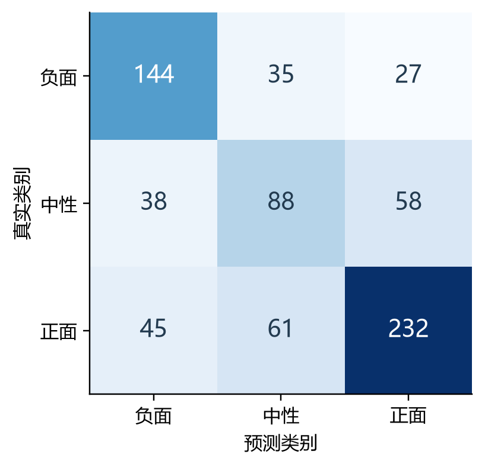

## 4.7 缺失模态、长度与位置的影响

图9分别按模态组合、名义遮蔽长度和位置汇总。T/TA/TV三组平均宏F1为0.56136，而A/V/AV三组为0.61537，相差约0.05401；相应MAE为0.65631和0.61407。这一差异表明，当前模型在所定义的扰动下明显依赖文本。

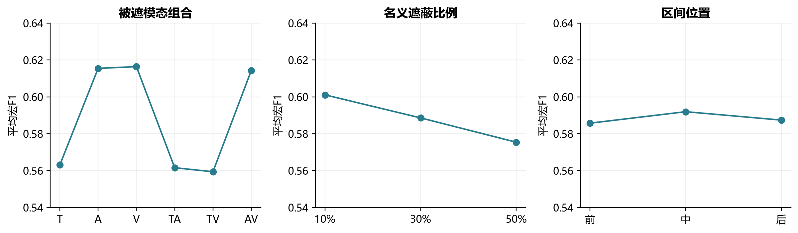

音频、视觉单独被遮以及二者同时被遮时，宏F1相对原样分别下降约0.00157、0.00065、0.00282。数值变化小，只能说明模型对这些局部扰动较不敏感，不能据此认定音视频对所有样本均无用。

名义遮蔽比例从10%提高到30%、50%时，平均宏F1约由0.6011降至0.5886、0.5754，MAE约由0.6211升至0.6333、0.6511。三档平均结果呈单调恶化，但这不是每个样本或每个种子均单调的证明。前、中、后位置的平均宏F1约为0.5857、0.5920、0.5874，差异小于0.007；本次结果未显示突出的单一高风险位置，也不足以确定其机制原因。

## 4.8 附件3推理

最终集成对附件3输出负面6条、中性9条、正面15条，强度约为−1.361至1.270。附件3的音视频零段可以不止一段，与最终训练的单连续区间增强不完全一致；统一掩码使接口能够处理这些位置，但不能替代专项真值评价。全量结果见表8。概率为模型输出，未经过校准，不当作正确率。

@TABLE_A3

# 5 问题三：从预测输出到可复核证据

## 5.1 固定预测器与解释对象

第三问直接复用C_uni三种子集成，不新增训练参数。解释对象是固定预测函数对输入信息的依赖，而不是从视频推断人物真实心理状态。对于每条样本先固定完整输入下的预测类别c，再分析哪些模态、哪些窗口提高或降低该类别的概率。

极性与强度采用不同输出头，解释也应区分目标。某模态可以提高负面类别概率，同时使回归数值减小；这两个变化方向并不矛盾。若直接把强度贡献的正负解释成“支持当前类别”，就会混淆两个任务。

## 5.2 三模态的组级Shapley分解

记模态集合M={T,A,V}。对任意子集S，保留S内特征，用参考值替换其他模态，得到X_S。类别和强度评价函数分别见式（23）。本文对三个模态整体做分解，不对877个单维特征逐个归因。

$$ v_c(S)=p_c(X_S),\qquad v_r(S)=\widehat{y}(X_S) $$

三个模态只有8个子集，可以精确枚举。根据Shapley分配原理[9]，模态m的贡献是其在不同加入顺序中的边际变化加权平均，如式（24）。

$$ \phi_m^q=\sum_{S\subseteq M\setminus\{m\}}\frac{|S|!(2-|S|)!}{3!}\left[v_q(S\cup\{m\})-v_q(S)\right] $$

其中q取c或r。程序检查贡献和满足式（25）；实际数值误差在10^−8量级。这一校验保证分解与所查询输出一致，但不证明参考输入具有唯一合理性。

$$ \sum_{m\in M}\phi_m^q=v_q(M)-v_q(\varnothing) $$

主分析参考值为训练集有效文本向量均值，以及音视频标准化后的零向量，同时保留原始可观测掩码。另一种参考将整路模态标记为不可用，用于敏感性比较。在可观测模态中，最大正向类别贡献对应主要参考模态。贡献有正有负，不必加和为1，也不作情绪百分比解释。

## 5.3 局部证据的选择与重编码检验

用原文字符范围建立原词到BERT子词的对应关系。构造连续三词窗口，尾部允许更短候选。对某个模态的窗口I使用参考值替换，定义类别支持度d和强度变化Δ，如式（26）。

$$ d_{m,I}=p_c(X)-p_c(X_{m,I\leftarrow ref}),\qquad \Delta_{m,I}=\widehat{y}(X)-\widehat{y}(X_{m,I\leftarrow ref}) $$

每路保留支持度为正、排序靠前的至多两个不重叠窗口。这里的“支持”仅相对于特征替换而言。为进一步核验文本，把候选原词对应的所有子词替换为[MASK]，经冻结BERT重新计算，再得到式（27）的原词级响应。

$$ d_I^{word}=p_c(X)-p_c\left(X_{T\leftarrow BERT(mask_I(text))}\right) $$

若特征层d为正而原词层d为负，该候选没有通过方向一致性检验，应保留为差异案例。本文借鉴扰动式解释评价关注输出变化的思想[10]，没有使用人工证据真值，因此不会将这种检验称为证据定位准确率。

## 5.4 原始素材中的证据定位

文本可由字符范围直接返回原句。音视频定位则有额外不确定性：官方特征没有逐行的原始秒数。本文以原文与视频音轨进行CTC强制对齐，再将aligned位置与词区间关联，得到估计时段；视觉关键帧从该时段附近按真实帧时间戳抽取。

这一映射依赖对齐特征与词序位置的对应假设，不能将重建词时刻称为官方音视频特征时间戳。低置信度或无法映射的候选不填写秒数。原视频回看用于核对说话内容、画面人物和时段是否一致，静态关键帧不能替代听音。

## 5.5 验证集上的解释敏感性

预测器未改变，因此基础验证指标与第二问相同。解释检验另外按真实类别分层抽取128条验证样本，排除5条缺少两个可比较窗口的短文本，得到123条。先按特征扰动排序选择窗口，再与另一随机三词窗口分别做原词重编码。随机窗口优先选不重叠位置，无合法不重叠窗口时从其他候选中选择。

式（28）统计首选窗口比随机窗口影响更大的比例。图10同时显示两种平均变化及配对关系，避免只报告一个均值。

$$ R_{win}=\frac{1}{n}\sum_i\mathbf{1}(d_{i,top}^{word}>d_{i,random}^{word}) $$

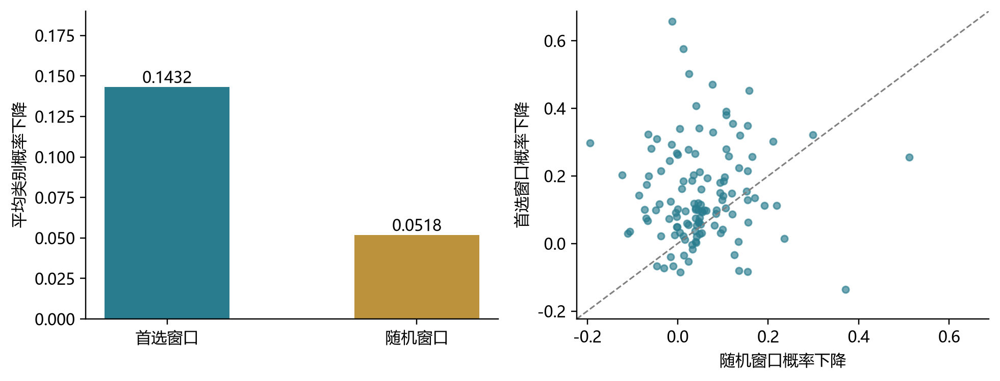

首选窗口平均使原类别概率下降0.1432，随机窗口为0.0518；首选优于随机的比例为73.17%，首选响应为正的比例为89.43%。结果支持“筛出的文本窗口在另一种干预下通常仍有较大影响”，但选择与检验仍基于同一预测器，存在选择偏差；该结果不能外推为音视频定位质量或人与模型的解释一致率。

## 5.6 附件4全量解释与典型案例

附件4共20条样本，预测负面9条、中性4条、正面7条。均值参考下18条主要参考文本，2条参考视觉，0条参考音频；更换参考方式有3条主模态发生变化。图11展示全部样本的三路类别贡献，表9列出全量预测，附录B补充对应解释摘要。

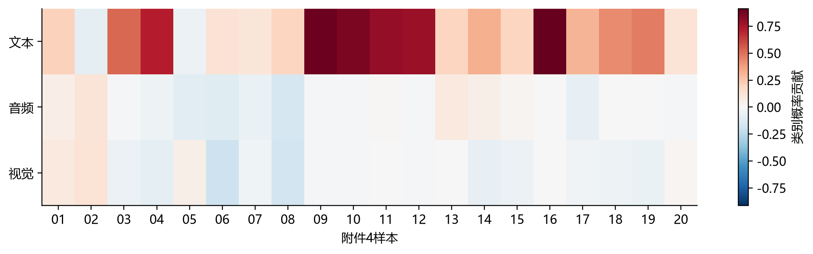

@TABLE_A4

输出的75条正向特征候选包括文本39、音频24、视觉12；69条有重建时段，6条因对齐不足未给秒数。文本39条中34条重编码后方向一致。附件4的13号样本内容位置上的视觉特征均不可观测，因此其视觉贡献为0，不列视觉证据。

样本10展示了较一致的文本依据。模型预测负面概率0.890、强度−1.595，文本的类别贡献约+0.861，音频和视觉均约−0.016。“was pretty terrible”对应估计时段7.51—9.21秒，原词遮蔽重编码后负面概率下降约0.274。图12将模态贡献、文本候选及视觉案例放在同一组图中，呈现不同层次的依据。

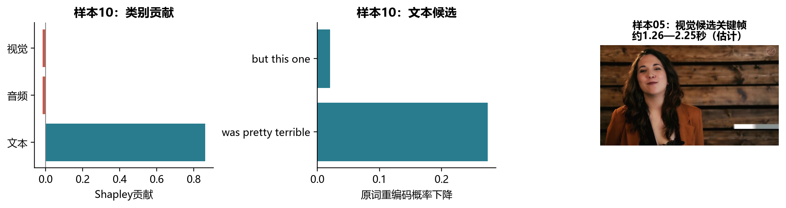

样本05的主要参考模态为视觉，其对正面类别贡献约+0.056，而对强度数值贡献约−0.021。该例表明类别贡献与强度贡献确有区别，但不能据此推断网络识别到特定表情。样本19则提示双头预测的不一致：负面概率约0.458，正面约0.431，强度却为+0.133。在无标签条件下，应记录输出冲突而不是直接裁定哪一头正确。

# 6 讨论与结论

本文的三部分工作分别建立时间对应、处理局部缺失和检查模型依据。第一问用词区间与帧支撑区间连接异步模态，能够输出完整特征、有效掩码和可回看记录；第二问把可观测位置显式引入编码与池化，避免无信息位置参与有效汇聚；第三问在固定预测器上量化模态和局部窗口的响应，提供从预测数值到原始素材的检查路径。

实验也揭示了方法的边界。第一问的91.3%有效词覆盖及裁剪候选91.00%人脸帧检出率均为代理指标，人工词边界与目标人物核验尚未完成。第二问的中性F1较低，且模型对文本缺失更敏感；更复杂的融合结构没有自动带来稳定收益。所有模型比较反复使用同一验证集，三个种子只能刻画有限的优化波动，不能作为独立泛化证据。

解释方面，参考值和遮蔽方式都会改变结果。Shapley分解的数值一致性、文本重编码的方向一致性、人与解释的语义一致性是不同层次的要求。当前完成了前两类计算，尚不能替代最后一类人工确认。音视频特征行到秒数的估计映射，也是第三问仍需重点检查的部分。

后续改进应优先围绕这些已暴露的问题展开：核对裁剪后的人脸身份与低置信度词边界；抽取中性误判样本分析错误；在固定训练预算下检验更有针对性的缺失分布；补充每个典型样本完整候选窗口的重要性曲线。现有结果支持本文方法在规定验证条件下完成联合预测和可复核解释，不支持“三模态贡献均衡”“辅助头显著提升”或“解释已等同真实情绪依据”等更强结论。

# 参考文献

[1] Bagher Zadeh A, Liang P P, Poria S, et al. Multimodal Language Analysis in the Wild: CMU-MOSEI Dataset and Interpretable Dynamic Fusion Graph. ACL, 2018: 2236–2246. https://aclanthology.org/P18-1208/

[2] Devlin J, Chang M W, Lee K, Toutanova K. BERT: Pre-training of Deep Bidirectional Transformers for Language Understanding. NAACL-HLT, 2019: 4171–4186. https://aclanthology.org/N19-1423/

[3] audEERING. openSMILE Python Interface Documentation. https://audeering.github.io/opensmile-python/ （访问日期：2026-09-25）

[4] librosa development team. librosa documentation. https://librosa.org/doc/ （访问日期：2026-09-25）

[5] Google. MediaPipe Face Landmarker Guide. https://ai.google.dev/edge/mediapipe/solutions/vision/face_landmarker （访问日期：2026-09-25）

[6] Meta AI. wav2vec2-base-960h model card. https://huggingface.co/facebook/wav2vec2-base-960h （访问日期：2026-09-25）

[7] Vaswani A, Shazeer N, Parmar N, et al. Attention Is All You Need. Advances in Neural Information Processing Systems, 2017, 30.

[8] Fang Y, Huang W, Wan G, Su K, Ye M. EMOE: Modality-Specific Enhanced Dynamic Emotion Experts. CVPR, 2025: 14314–14324. https://openaccess.thecvf.com/content/CVPR2025/papers/Fang_EMOE_Modality-Specific_Enhanced_Dynamic_Emotion_Experts_CVPR_2025_paper.pdf

[9] Lundberg S M, Lee S I. A Unified Approach to Interpreting Model Predictions. Advances in Neural Information Processing Systems, 2017, 30.

[10] DeYoung J, Jain S, Rajani N F, et al. ERASER: A Benchmark to Evaluate Rationalized NLP Models. ACL, 2020: 4443–4458. https://aclanthology.org/2020.acl-main.408/

# 附录A 第一问100条样本结果汇总

以下为基础版本。全部样本具有文本768、音频70、视觉61维表示，对齐参考为词时间区间，输出保留BERT子词。表内时长取视频解码元数据；有效音频、视觉位置数为聚合后的token数量。完整时间轴、音频解码时长和逐帧向量见配套JSON与NPZ，不由此表替代。

@TABLE_Q1

# 附录B 附件4解释摘要

下表类别贡献使用训练均值参考。每条仅列一个主要模态候选，完整候选保留在解释CSV。时间为CTC重建估计；空缺时间表示不可可靠定位，并非没有证据。文本方向检验为正只代表原词干预后的模型响应，不等于人工认可。

@TABLE_EXPLANATIONS

# 附录C 复现范围与材料说明

论文结果来自已保存实验。绘制图表和重新排版不触发新训练，不更改原始数据。第一问采用data/processed/q1基础版；第二问最终配置为configs/q2_final.json中的C_uni；第三问为q3_c_uni_final_20260925，不使用历史新结构训练的权重。主要结果的源文件索引随本稿另附。

重新训练需要附件2原始特征、固定BERT与训练环境；附件3推理还需要最终三份模型权重；第三问视频定位需要附件4原视频与CTC模型。仅读已有NPZ和CSV可以完成多数统计图，含原画面的图不能只凭源码重画。详细运行命令统一保留在工程根目录《运行使用说明.md》。源码仓库不包含原始数据和预训练权重，不能将仓库下载成功视为完整推理环境已就绪。

历史记录的运行环境为Python 3.12、PyTorch 2.7.1+cu128、Transformers 5.17.0；BERT固定revision为86b5e0934494bd15c9632b12f734a8a67f723594。本文未补造未记录的软件版本。最终提交前仍须补齐可用的完整依赖清单、确认AI工具实际使用记录、检查官方模板及匿名要求，并验证包含所选特征与共享模型权重的附件总大小。本稿为供队内审阅的研究初稿，不作为这些交付检查已通过的证明。
